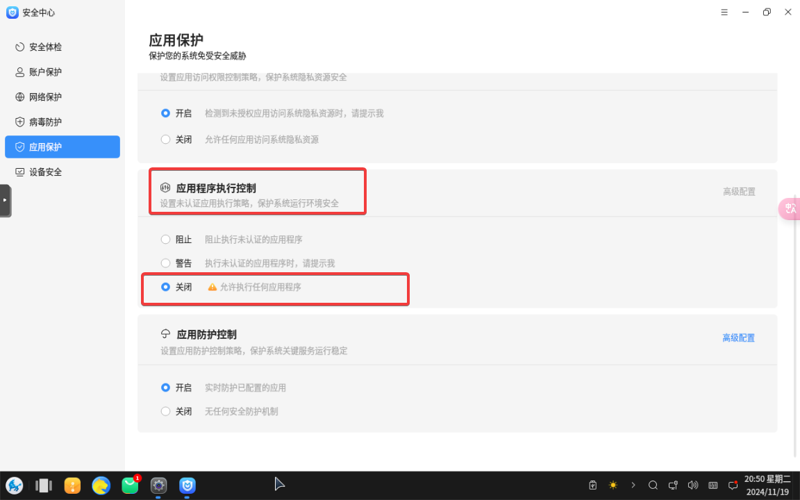
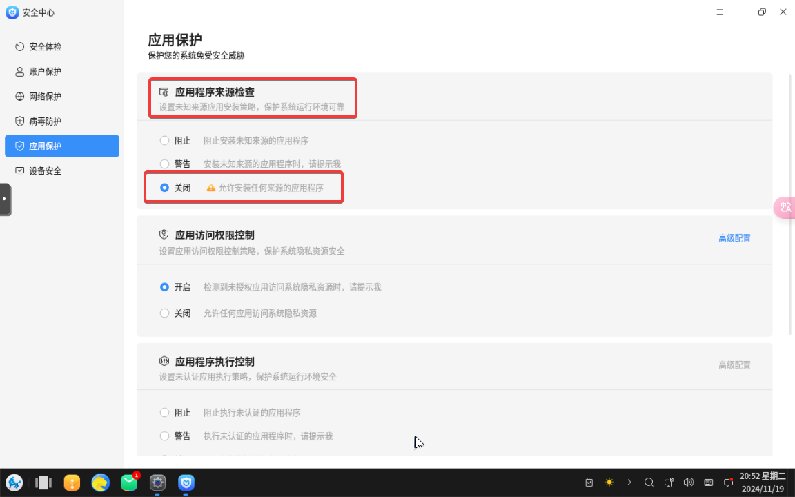
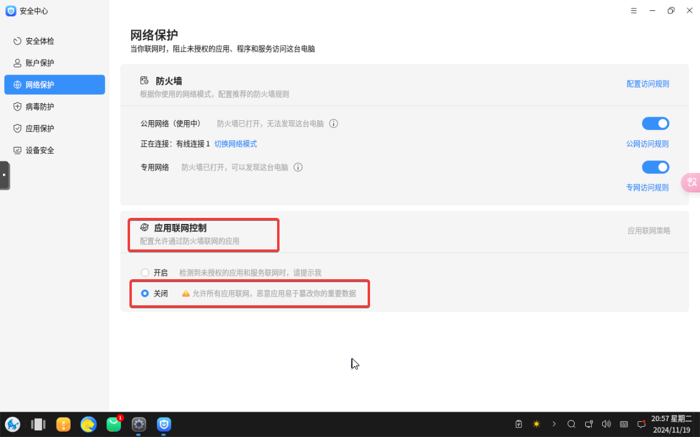

# 银河麒麟操作系统专区

- 由于银河麒麟的安全限制，需要做到以下 `四点` 才能安装 `Kubernetes`

[[toc]]

## 1. 关闭【应用程序执行控制】

- 只要关闭此配置，才能执行 `Shell` 脚本、安装完成的软件才能执行
- 要一直保持关闭，否则 `Kubernetes` 集群会异常



## 2. 关闭【应用程序来源检查】

- 只要关闭此配置，才能安装非 `银河麒麟` 官方仓库的软件，如：`containerd`、`kubelet`、`kubeadm`、`kubectl` 等



## 3. 关闭【应用联网控制】

- 只要关闭此配置，`Kubernetes` 才能（拉取镜像）初始化成功



## 4. 银河麒麟限制可执行 Shell 脚本的来源，使用下列方式绕过系统检查

- `银河麒麟` 限制非当前系统创建的文件，无法 `增加`、`修改` `/etc` 目录下的文件，如：`/etc/fstab`（交换空间）、`/etc/apt`（包管理器配置文件夹） 等

```shell
curl -k -o tmp.sh https://k8s-sh.xuxiaowei.com.cn/k8s.sh

echo '' > k8s.sh
cat tmp.sh >> k8s.sh
chmod +x k8s.sh
./k8s.sh standalone

# 等效命令
# sudo ./k8s.sh swap-off curl ca-certificates firewalld-stop selinux-disabled bash-completion docker-repo containerd-install containerd-config kubernetes-repo kubernetes-install kubernetes-images-pull kubernetes-config kubernetes-init kubernetes-init-node-name=k8s-1 calico-install kubernetes-taint ingress-nginx-install ingress-nginx-host-network metrics-server-install enable-shell-autocompletion print-join-command kubernetes-init-congrats
```
